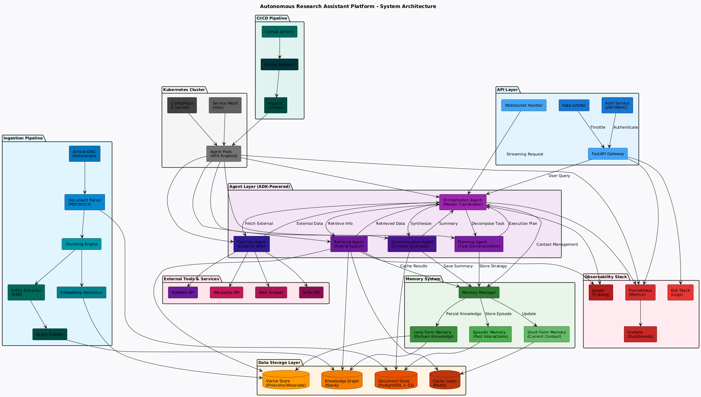

# Autonomous Research Assistant

[](https://www.python.org/downloads/)
[](https://fastapi.tiangolo.com/)
[](https://pypi.org/project/google-adk/)
[](https://neo4j.com/)
[](https://qdrant.tech/)
[](https://github.com/chonkie-ai/chonkie)
[](https://www.docker.com/)
[](https://streamlit.io/)

A production-grade, multi-agent AI system capable of conducting deep research by autonomously searching the web, analyzing academic papers, and exploring knowledge graphs. Built with a microservices architecture and containerized with Docker.



## Key Features

*   **Multi-Agent Swarm**:
    *   **Orchestrator**: Routes user queries and handles casual conversation.
    *   **Planning Agent**: Decomposes complex research questions into sub-tasks.
    *   **Tool Use Agent**: Scrapes the web (Google, Wikipedia) and fetches academic papers (arXiv).
    *   **Retrieval Agent**: Performs Hybrid RAG (Vector + Graph) interacting with Qdrant and Neo4j.
    *   **Summarization Agent**: Synthesizes findings into a coherent final report.

*   **Hybrid RAG (Retrieval-Augmented Generation)**:
    *   Combines **Vector Search** (Qdrant) for semantic similarity.
    *   Combines **Knowledge Graph** (Neo4j) for entity relationship exploration.
    *   **Advanced Chunking**: Uses **Chonkie** for semantic-aware text chunking, ensuring optimal context retrieval for the LLM.

*   **Persistent Memory**:
    *   All conversations and "Thought Paths" are saved to **PostgreSQL**.

*   **Fully Containerized**:
    *   5-container microservices setup (Frontend, Backend, Postgres, Qdrant, Neo4j).
    *   One-command deployment via Docker Compose.

*   **Modern UI**:
    *   Built with **Streamlit**.
    *   Features session management (New Chat, Load History, Delete Session).
    *   Visualizes the live "Agent Path" (e.g., `orchestrator → planning → retrieval`).

---

## Tech Stack

*   **Frontend**: Streamlit, Python
*   **Backend**: FastAPI, Google ADK (Agent Development Kit), Google Gemini 2.0 Flash
*   **Data Pipeline**:
    *   **Chonkie**: High-performance semantic chunking library.
    *   **Qdrant**: Vector Database for embeddings.
    *   **Neo4j**: Knowledge Graph for structured associations.
*   **Databases**:
    *   **PostgreSQL**: User sessions & interaction history.
*   **Infrastructure**: Docker, Docker Compose
*   **Testing**: Pytest

---

## Getting Started

### Prerequisites

*   [Docker Desktop](https://www.docker.com/products/docker-desktop/) installed and running.
*   A **Google Cloud API Key** (for Gemini).
*   A **Serper Dev API Key** (for Google Search).

### 1. Clone the Repository
```bash
git clone https://github.com/limemanas/autonomous-research-assistant.git
cd autonomous-research-assistant
```

### 2. Configure Environment
Create a `.env` file in the root directory (or use the provided template).
```ini
# Core
GOOGLE_API_KEY=your_google_key_here
MODEL=gemini-2.0-flash

# External Tools
SERPER_API_KEY=your_serper_key_here

# Database Secrets (Docker will use these to set up DBs)
POSTGRES_USER=postgres
POSTGRES_PASSWORD=yourpassword
POSTGRES_DB=user_db
NEO4J_USER=neo4j
NEO4J_PASSWORD=yourpassword
```

### 3. Run with Docker
Launch the entire system:
```bash
docker-compose up --build
```
*Wait a moment for all services to initialize.*

*   **Frontend**: [http://localhost:8501](http://localhost:8501)
*   **Backend API**: [http://localhost:8000/docs](http://localhost:8000/docs) (Swagger UI)

---

## Development & Testing

### Running Tests
The project includes unit tests for the API and Memory layers.
```bash
# Install test dependencies locally if needed
pip install pytest pytest-asyncio httpx

# Run tests
pytest backend/tests/
```

### Project Structure
```
.
├── backend/
│   ├── agents/         # Agent definitions (Orchestrator, Planner, etc.)
│   ├── ingestion/      # Data pipeline (Chunking, Embedding)
│   ├── memory/         # Database logic (Postgres)
│   ├── storage/        # RAG logic (Qdrant, Neo4j)
│   ├── tests/          # Unit tests
│   ├── tools/          # Tools (Arxiv, Search, Memory)
│   ├── api.py          # FastAPI application
│   └── Dockerfile
├── frontend/
│   ├── app.py          # Streamlit UI
│   └── Dockerfile
├── docker-compose.yml  # Orchestration
├── pyproject.toml      # Dependencies
└── README.md
```
